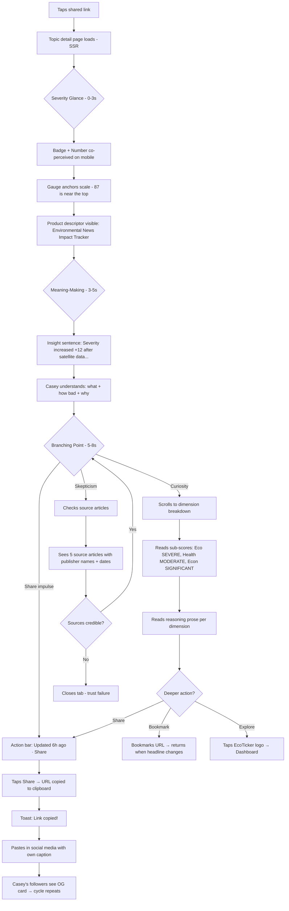
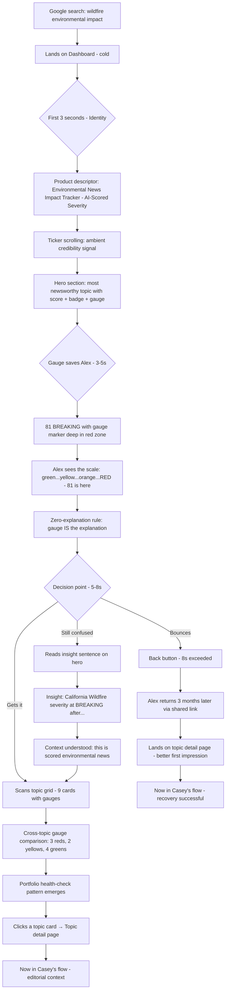
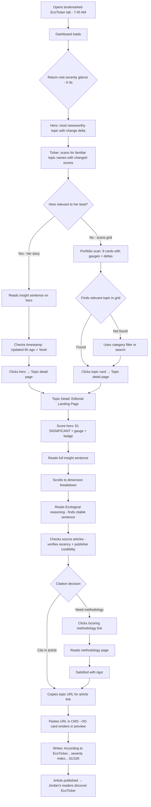
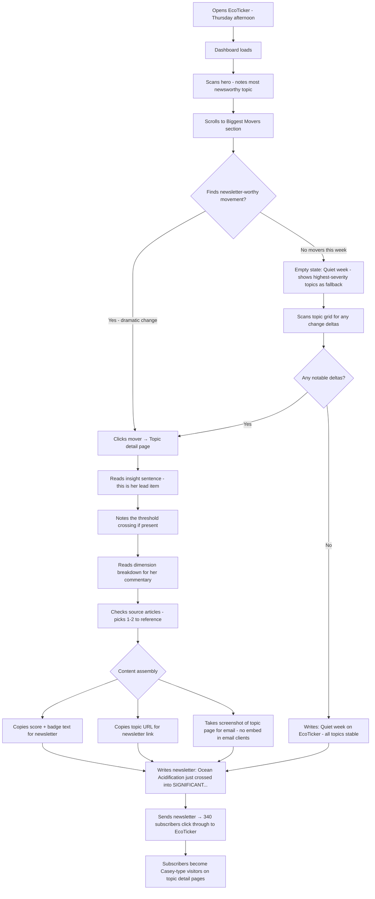
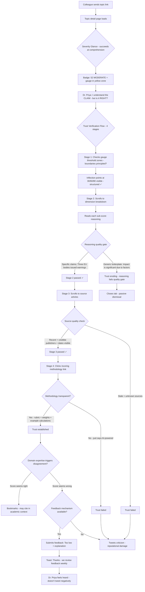
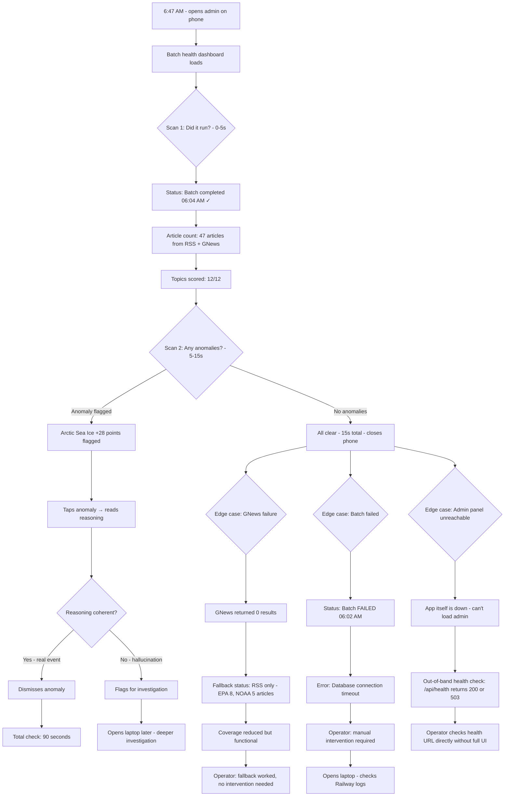

# UX Design Specification — EcoTicker

**Author:** Sidhartharora
**Date:** 2026-02-21

---

<!-- UX design content will be appended sequentially through collaborative workflow steps -->

## Executive Summary

### Project Vision

EcoTicker applies the emotional vocabulary of financial markets — severity scores, sparklines, urgency badges, biggest movers — to environmental news. The core UX hypothesis: a numerically quantified gut-punch (a score + urgency badge) creates shareable urgency for environmental events, the same way a stock market crash creates urgency even for non-investors.

The product is brownfield with Epics 1–3 shipped (scoring engine, dashboard UI, social sharing). The UX design specification addresses the current product's gaps and defines the visual/interaction framework for remaining MVP and Growth features.

### Target Users

| Persona | Context | Device | Core UX Need |
|---|---|---|---|
| Casey (Concerned Citizen) | Arrives via social share, evening browsing | Mobile-first | Understand severity in <10 seconds, share easily |
| Jordan (Journalist) | Morning tab rotation, writing deadline | Desktop-first | Citable data, perfect social card rendering |
| Alex (Bounced Visitor) | Cold landing via search, zero context | 50/50 | Instant comprehension of what the numbers mean |
| Morgan (Sustainability Officer) | Quarterly report assembly | Desktop | Embed widgets, stable URLs, CSV export |
| Fatima (Newsletter Creator) | Weekly content curation | Desktop | Biggest Movers as source material, shareable scores |
| Dr. Priya (The Skeptic) | Domain expert, skeptical of AI scores | 50/50 | Transparency, feedback mechanism, source verification |
| Operator (Reactive) | 6:47 AM phone check | Mobile | 90-second batch health scan |
| Operator (Strategic) | Monthly coverage review | Desktop | Keyword management, analytics |

**Device split:** 50/50 mobile/desktop. Neither viewport is secondary. Social shares drive mobile traffic; professional use drives desktop.

**Return visit model:** No push notifications. Return visits are driven entirely by content changes — the dynamic insight headline, biggest movers, and ticker bar must create a "morning check" habit comparable to checking stock markets. The ticker bar is the primary ambient change signal for return visitors — not decoration, but the return-visit hook.

### Key Design Challenges

1. **Cold Landing Problem** — First-time visitors with zero context have ~8 seconds before bouncing. A major attention-grabbing visual element must instantly communicate what the scores mean and why they matter. This is the product's single biggest retention gap. The score scale indicator (FR20) is critical UX infrastructure, not a minor enhancement — without a visual severity gauge, cold landings will always fail regardless of other design choices.

2. **Dual Tone: Urgency + Credibility** — The visual design must blend gut-punch urgency (bold scores, red badges, motion) with journalistic credibility (clean data presentation, source attribution, methodology transparency). Target aesthetic: **Weather Radar meets Bloomberg** — the color/urgency hit comes first (weather radar — instant emotional comprehension), the precision data comes second (Bloomberg — data density for professionals). Color-first, data-second.

3. **Two Hero Experiences** — Social shares land on the topic detail page, not the dashboard. Direct/return visitors land on the dashboard. These are different UX problems requiring different hero treatments:
   - **Dashboard hero:** "What changed today?" — most urgent or most-changed topic, oriented toward return visitors
   - **Topic detail hero:** "Here's the thing your friend shared, and here's why it matters" — oriented toward first-time share arrivals

4. **Emotional Funnel (Homepage)** — The homepage is not a flat grid of equal-weight cards. It is a time-sequenced emotional experience:
   - **0–3 seconds:** Gut-punch (hero score, color, urgency badge, severity gauge)
   - **3–8 seconds:** Context ("this is about environmental severity, and 87/100 means very bad")
   - **8–15 seconds:** Exploration (biggest movers, topic grid — "what else is going on?")
   - **15+ seconds:** Decision point (share, bookmark, or deep-dive into a topic)

5. **50/50 Device Parity** — The hero elements and all core interactions must perform equally on mobile and desktop. Social shares land on mobile; professional citation happens on desktop.

6. **Habit Formation Without Notifications** — No push, no email, no newsletters from the product itself. The UX must make return visits intrinsically rewarding by leading with change. The ticker bar provides ambient change awareness; the insight headline provides the narrative summary; biggest movers provides the drill-down.

### Design Opportunities

1. **"Weather Radar meets Bloomberg" Identity** — A bold, data-forward hero section that leads with color/urgency (instant emotional comprehension like a weather radar) backed by precise data density (Bloomberg-level information for professionals). No existing tool occupies this aesthetic space for environmental data.

2. **Score as Brand** — The number IS the brand. "87 BREAKING" in a red badge is the viral artifact. The score needs a **consistent visual container** — a recognizable badge unit (score + urgency label + severity color) that appears identically across: dashboard hero, topic detail page, OG social cards, and future embed widgets. This is the EcoTicker "logo unit."

3. **Severity Gauge** — A visual severity indicator (thin horizontal bar, green-to-red gradient, score position marked) built into every score display. Makes the 0–100 scale self-explanatory without requiring text. Inspired by fitness app heart rate zones — instant comprehension, zero learning curve.

4. **Micro-Motion for Urgency** — Subtle animations (score pulse on BREAKING topics, sparkline draw-on-load, ticker scroll speed proportional to overall severity level) convey urgency without crossing into sensationalism. All motion respects `prefers-reduced-motion`.

5. **"What Changed" as Homepage Identity** — Lead with change rather than static state. Every return visit immediately answers: "Did anything get worse? Did anything improve?" The emotional funnel ensures this answer arrives in the first 3 seconds.

6. **Ticker Bar as Return-Visit Hook** — The scrolling ticker isn't ambient decoration — it's the primary signal that things have changed since the last visit. Return visitors scan the ticker for familiar topics with different scores. Scroll speed, color changes, and score deltas make the ticker a functional change-detection tool.

## Core User Experience

### Defining Experience

The core user experience of EcoTicker is a **severity glance** — seeing a score, feeling its weight through color and urgency, and instantly knowing "how bad" without expertise. This is not a reading experience, an analysis experience, or a research experience. It is a gut-check: see badge → feel gauge → read number → decide to act.

Every screen in EcoTicker serves this moment. The dashboard serves it at portfolio level ("how bad is everything?"). The topic detail page serves it at single-topic level ("how bad is this one thing my friend shared?"). The ticker bar serves it at ambient level ("this is a live data product — news is happening").

**Core Loop:**
1. **Arrive** (via social share or direct visit)
2. **Glance** (badge + color + gauge = instant severity comprehension — design encodes severity, doesn't manufacture it)
3. **Feel** (the data delivers the gut-punch when severity is genuinely high — the design is a codec, not an amplifier)
4. **Act** (share, deep-dive, or bookmark for later)
5. **Return** (when something changes — driven by habit, not notifications)

### Platform Strategy

| Dimension | Decision | Rationale |
|---|---|---|
| Platform | Web only (responsive) | No native app. Social shares must open in browser without app install friction. |
| Rendering | SSR + selective client hydration | Fast initial paint for social share arrivals. Client hydration for charts, ticker, theme toggle. **Critical:** The hero section (badge + gauge + number) must be pure SSR — zero client JS dependency in the 0–3 second legibility window. |
| Input model | Touch + mouse equally | 50/50 mobile/desktop. All interactions must work with both tap and click. |
| Offline | Not required | Daily batch data; no real-time updates. Stale data is acceptable for 24 hours. |
| Orientation | Portrait-first on mobile | Social share arrivals hold phone vertically. Dashboard grid stacks to single column. |
| Accessibility | Keyboard-navigable, screen-reader compatible | All interactive elements focusable. Color never sole indicator (text labels accompany badges). |
| Performance | <3s LCP on mobile | The 0–3 second legibility window starts at page load. Every second of load time eats into comprehension time. |

**Key platform constraint:** Recharts requires client-side JS for SVG rendering. Sparklines and score charts appear after hydration. The entire hero section — badge, severity gauge, score number — is server-renderable with zero Recharts dependency. This is an architectural advantage that directly enables the 0–3 second legibility goal.

### Information Hierarchy

The core severity communication follows a strict hierarchy derived from first principles:

1. **Badge** (primary) — "BREAKING", "CRITICAL", "MODERATE", "INFORMATIONAL". The urgency badge is the primary severity signal. Users don't need to understand the 0–100 scale — they need to understand the severity. The badge IS the severity.
2. **Gauge** (confirmation) — A visual severity indicator (thin bar, green-to-red gradient). Confirms the badge with visual weight. Works like a thermometer — you don't read the number to know the mercury is dangerously high.
3. **Number** (precision) — The score (e.g., "87"). Secondary precision for power users, journalists citing data, and the viral artifact ("87 BREAKING" travels on social media).

**Two jobs of severity communication:**
- **Color + badge + gauge** communicate severity to the *viewer* (comprehension)
- **Number + badge** communicate severity to the *sharer's audience* (transmission)

The design encodes severity — it doesn't manufacture it. A score of 87 in a red badge is alarming because 87 is genuinely high, not because the design added artificial urgency. The color IS data communication, not decoration.

### Product Identity

A persistent one-line product descriptor visible on the dashboard beneath the logo or site title:

> **"Environmental News Impact Tracker — AI-Scored Severity"**

This addresses the cold-landing identity gap: first-time visitors need to know what the product IS before they can interpret any scores. The descriptor is subtle, always-present, and answers "What is this website?" in under 2 seconds. Not a hero banner — a quiet identity line.

### Effortless Interactions

| Interaction | Effortless Target | Current State |
|---|---|---|
| **Understand severity** | Zero explanation — badge + gauge + color make severity self-evident without reading | Partially solved (color + badge exist; severity gauge missing) |
| **Share a topic** | Share button placed next to the score (peak intent at 3–8 seconds), one tap copies clean URL to clipboard, social card renders perfectly | Implemented (US-6.1) — placement audit needed, confirm URL copy not platform-specific share sheet |
| **Know what changed** | Hero section communicates the most newsworthy topic on load, without scrolling | Partially solved (insight headline exists; hero section evolution needed) |
| **Find a specific topic** | Filter-as-you-type search (hidden behind search icon next to category filter) for power users; category filter for casual browsing | Partially solved (US-1.4 category filter exists; search missing) |
| **Check freshness** | "Updated 6h ago" timestamp visible on every dashboard topic card and detail page | Partially solved (FR29 exists; not surfaced on dashboard cards) |
| **Switch theme** | One click, persists across sessions, no flash | Implemented (localStorage, FOUC script) |
| **Understand the methodology** | One click from any score to the /scoring page | Implemented (US-2.2) |
| **Read source articles** | Visible on topic detail, attributed, linked to original | Implemented (article list with attribution) |

### Critical Success Moments

**Equal-priority critical moments (both must succeed for the product to work):**

1. **The Cold-Landing First Impression (0–3 seconds)**
   - *What happens:* A first-time visitor sees the page for the first time
   - *Success:* **Instant legibility** — they can read the badge, see the gauge, understand severity, and know what the product is (via the descriptor). The design encodes the data clearly; if severity is high, the gut-punch is emergent.
   - *Failure:* "These numbers mean nothing to me" or "What is this website?" → back button → gone forever
   - *Design implication:* Badge → gauge → number hierarchy. Product descriptor visible. All server-rendered. Zero client JS in the critical path.

2. **The Share Moment (3–8 seconds)**
   - *What happens:* The user comprehends severity and feels the impulse to share
   - *Success:* Share button is visible *next to the score* (at the moment of peak intent). One tap copies a clean topic URL. The social card renders professionally with topic name, score, badge, and date.
   - *Failure:* Share button is 3 scrolls below the score (impulse dies), card looks unprofessional (confidence dies)
   - *Design implication:* Share button co-located with score on both dashboard cards and topic detail. Social card must look credible enough that a journalist would use it.

**Supporting success moments:**

3. **The Return Visit Check (0–5 seconds)** — Hero section shows the "most newsworthy right now" topic using a combined signal: severity weighted 60% + recency of change weighted 40%. A topic that just became BREAKING today outranks one that's been BREAKING for a week. Neither pure severity nor pure delta — weighted blend of both.

4. **The Journalist Citation (30+ seconds)** — Jordan copies a topic URL into an article. The link preview renders a professional social card. The /scoring methodology page is one click away. "Updated 6h ago" confirms data freshness. Success: "I can cite this." Failure: "This looks unprofessional / stale data / no methodology."

5. **The Skeptic's Trust Check (10–20 seconds)** — Dr. Priya checks the reasoning and source articles. They're recent, relevant, and from credible publishers. Success: "Okay, this is based on real reporting." Failure: "Stale data, no sources, can't verify."

### Above-the-Fold Rules

| Page | Viewport | Above-the-Fold Requirement |
|---|---|---|
| Dashboard | Desktop | Product descriptor + hero section (score + badge + gauge + insight sentence + share button) + beginning of topic grid |
| Dashboard | Mobile | Product descriptor + hero section (score + badge + gauge + insight sentence + share button) |
| Topic Detail | Desktop | Topic name + score + badge + gauge + share button + beginning of reasoning |
| Topic Detail | Mobile | Topic name + score + badge + gauge + share button. No preamble content above the fold. Score must be the first visible content below the topic name. |

### Hero Section Logic

The dashboard hero displays the single most newsworthy topic, determined by a combined signal:

```
heroScore = currentScore × 0.6 + abs(currentScore - previousScore) × 0.4
```

- A stable BREAKING topic (87, change 0) scores: `87 × 0.6 + 0 × 0.4 = 52.2`
- A dramatic rise (40 → 65, change 25) scores: `65 × 0.6 + 25 × 0.4 = 49.0`
- A new BREAKING event (0 → 88, change 88) scores: `88 × 0.6 + 88 × 0.4 = 88.0`

This ensures genuinely alarming new events dominate the hero, stable high-severity topics remain visible, and moderate changes don't overshadow critical persistent topics.

**Tie-breaker rule:** When two topics produce identical heroScores, prefer the topic with the most recent `updatedAt` timestamp. If timestamps are also identical, prefer the topic with the higher absolute `currentScore` (severity wins).

The hero section is an **evolution of the existing `InsightHeadline` component** — merged with score display, badge, gauge, and share button. Not a net-new section.

### Ticker Bar Role

The ticker bar serves two distinct functions:

1. **Primary: Ambient credibility and product identity** — Its presence signals "this is a live data product, not a blog." Like the CNN news crawl — you don't read every item, but its existence communicates that news is happening. This serves first-time visitors establishing trust.
2. **Secondary: Rapid scan for return visitors** — Returning users can scan the ticker for familiar topic names with different scores. This is supplementary to the hero section, not the primary change-detection mechanism.

The ticker bar is NOT the primary change-detection tool — that role belongs to the hero section and the Biggest Movers section.

### Experience Principles

1. **Severity in a Glance** — The core interaction is seeing a badge + gauge and instantly knowing "how bad." Every screen, component, and layout decision serves this single moment of comprehension. If a design choice doesn't make the severity glance faster or clearer, it doesn't belong.

2. **Badge Before Gauge, Gauge Before Number** — Information hierarchy follows the codec principle: the design encodes severity that's already in the data. The urgency badge hits first ("BREAKING"), the severity gauge confirms it visually (red zone), the number adds precision (87). This sequence works for experts and newcomers alike, and is fully server-renderable.

3. **Severity First, Change Second** — Absolute severity is the primary signal. Change is the secondary signal that drives return visits. The hero section uses a weighted blend (60% severity, 40% recency of change) to surface the "most newsworthy right now" — neither pure state nor pure delta.

4. **Confidence to Amplify** — The share bottleneck is *willingness*, not ability. Users share when they trust the source. Credible design, visible article sources, transparent methodology link, and a professional social card preview build the confidence to share. Without confidence, a one-tap share button is useless.

5. **One Tap to Amplify** — Frictionless sharing enables the *ability* to share. Share button co-located with the score at the moment of peak intent (3–8 seconds after comprehension). Clean URL copy to clipboard. `shares = willingness × ability` — both principles are necessary, neither is sufficient alone.

6. **No Explanation Required** — If a user needs to read instructions, the design has failed. The badge, severity gauge, and color coding must make severity self-evident to someone who has never heard of EcoTicker. The /scoring page exists for the curious and skeptical, not for basic comprehension.

### Implementation Notes

- **Severity gauge:** Pure CSS component (`SeverityGauge.tsx`) — `linear-gradient(green, yellow, orange, red)` with absolute-positioned marker at `left: ${score}%`. Fully SSR-compatible. Reusable across hero, cards, detail page, and future embed widget.
- **Hero section:** Evolution of existing `InsightHeadline` component — merged with score display, badge, gauge, and share button. Hero topic selected server-side in dashboard `page.tsx` using weighted algorithm: `heroScore = currentScore × 0.6 + abs(change) × 0.4`. No new API endpoint.
- **Topic search:** Client-side filter-as-you-type on loaded topic list. Hidden behind search icon adjacent to category filter. No API changes.
- **Share button placement:** Co-located with score on both `TopicCard` and topic detail page. Clean URL copy to clipboard (not platform-specific share sheet). Responsive testing required for both viewports.
- **Timestamp on cards:** Surface `updatedAt` as "Updated Xh ago" on every `TopicCard`. Data already available from `/api/topics` response.
- **Product descriptor:** One-line subtitle in dashboard layout. Pure HTML, zero logic.
- **Above-the-fold audit:** Topic detail page mobile — verify score + badge + gauge + share button visible without scrolling below topic name.

## Desired Emotional Response

### Primary Emotional Goals

| Emotion | Trigger | Design Mechanism |
|---|---|---|
| **Informed Urgency** | Seeing a high-severity topic, understanding why it's severe, feeling compelled to inform others | Badge → gauge → number hierarchy delivers instant comprehension. Reasoning summary delivers understanding. The share impulse comes from *knowing something your followers don't* — not from panic. |
| **Confidence** | Understanding what the numbers mean within 3 seconds | Badge → gauge → number hierarchy. Product descriptor. No explanation required. The user feels "I get this" immediately. |
| **Trust** | Seeing credible sources, transparent methodology, professional presentation | Source attribution on articles, /scoring methodology link, clean data-forward design, "Updated Xh ago" timestamp. The user feels "I can rely on this." |
| **Reward (on return)** | Seeing that something changed since last visit | Hero section highlights most newsworthy change, ticker bar shows familiar topics with new scores, explicit change deltas (+12, -8) on cards. The user feels "glad I checked." |
| **Stable is Good News** | Seeing that topics are stable or improving | Green arrows, "improved" language, hero can say "No major changes today — all topics stable." Stability is a positive health check, not absence of news. |

### Emotional Journey Mapping

| Stage | Moment | Target Emotion | Anti-Emotion (to prevent) |
|---|---|---|---|
| **First landing (0–3s)** | See badge + gauge + product descriptor | Confidence ("I understand this") | Confusion ("what do these numbers mean?") |
| **Comprehension (3–8s)** | Read the hero topic's severity + reasoning summary | Informed urgency ("this is serious, I understand why") | Indifference ("so what?") |
| **Exploration (8–15s)** | Scan biggest movers + topic grid | Curiosity ("what else is going on?") | Overwhelm ("too much data") |
| **Action (15s+)** | Tap share / click into a topic | Agency ("I can inform others") | Doubt ("is this credible enough to share?") |
| **Return visit (0–5s)** | See hero change + ticker delta | Reward ("glad I checked back") | Staleness ("nothing changed, why did I come back?") |
| **Stable return visit** | See stability / improvement signals | Relief ("everything's within normal range") | Boredom ("this product is dead") |
| **Error / empty state** | No data, failed load | Patience ("they're working on it") | Abandonment ("this is broken") |

### Graduated Emotional Weight

Each severity level has its own intentional emotional character — not just "less red." Lower severity is not a diminished version of BREAKING; it is its own meaningful signal.

| Level | Score Range | Target Emotion | Visual Character | Card Feel |
|---|---|---|---|---|
| **INFORMATIONAL** | 0–29 | Calm, reassuring | Green tones, gauge in low zone | Quiet, monitored. "This is being tracked and it's okay." |
| **MODERATE** | 30–59 | Watchful, attentive | Yellow tones, gauge in mid zone | Subtle visual weight. "Something to keep an eye on." |
| **CRITICAL** | 60–79 | Serious, newsworthy | Orange tones, gauge in upper zone | Clear visual weight — bolder type or subtle border accent. "This deserves attention." |
| **BREAKING** | 80–100 | Grave, urgent | Red tones, gauge in danger zone | Loudest element on the page. Badge is the dominant visual. "This is severe." |

**Key principle:** Every severity level should feel like the RIGHT amount of concern for that severity. MODERATE should feel exactly right for a moderate issue — not like a failed BREAKING. INFORMATIONAL cards should feel like positive signals ("stable, monitored"), not empty states.

### Micro-Emotions

**Critical micro-emotion pairs — the design must push toward the left column:**

| Desired | To Avoid | Design Lever |
|---|---|---|
| Confidence | Confusion | Badge → gauge → number hierarchy; product descriptor |
| Trust | Skepticism | Source attribution; methodology link; timestamp freshness |
| Informed urgency (data-driven) | Sensationalism (design-driven) | Design encodes, doesn't amplify. Badge language is urgent; visual chrome is not. |
| Agency | Helplessness | Share button at point of peak intent; clean URL copy |
| Curiosity | Overwhelm | Progressive disclosure: hero → movers → grid. Not everything at once. |
| Reward | Staleness | Explicit change deltas on cards and hero; "most newsworthy" hero rotation |
| Relief (stable) | Boredom (dead) | Stability = good news. Green arrows, "improved" language, positive framing. |

### Design Implications

| Emotional Goal | UX Design Approach |
|---|---|
| Informed urgency | Warm cream/beige base (not dark/aggressive). Red reserved for BREAKING badges only — not splashed on backgrounds or borders. Urgency comes from the data and badge language, not from design chrome. |
| Confidence | Consistent visual language. The score badge unit (number + badge + gauge) looks identical everywhere — dashboard, detail page, social card, embed. Predictability builds confidence. |
| Trust | No decoration for decoration's sake. Every visual element carries information. Source publisher names visible. "AI-Scored" disclosed in product descriptor. Methodology one click away. |
| Reward on return | Change deltas shown as signed numbers (+12 ↑, -8 ↓) with directional color (red = worsening, green = improving). Hero section rotates to most newsworthy change. Ticker scroll includes delta indicators. |
| Stable is good news | Improving/stable topics show green arrows, "improved" or "stable" labels. Hero can display "No major changes — all topics stable." A return visit with no changes is a positive health check, not a dead page. |
| Prevent overwhelm | Dashboard follows the emotional funnel (hero → movers → grid). Topic grid uses category filter and search to narrow. Detail page is single-column, focused. No sidebar, no competing panels. |
| Graduated weight | Each severity level has distinct visual character (see table above). INFORMATIONAL feels calm, MODERATE feels watchful, CRITICAL feels serious, BREAKING feels grave. Never treat lower severity as "less designed." |

### Two-Reds Rule

The severity gauge and the BREAKING badge use different reds to serve different cognitive functions:

| Element | Red Type | Purpose |
|---|---|---|
| **Severity gauge** (gradient endpoint) | Muted, dark warm red | Background reference — "this is the dangerous end of the scale." Static, expected, always present. |
| **BREAKING badge** | Bright, saturated red | Foreground signal — "THIS TOPIC IS HERE RIGHT NOW." Dynamic, rare, demands attention. |

Same hue family, different saturation and brightness. The eye processes them at different cognitive levels. The gauge normalizes the *scale*; the badge signals the *state*. Color scarcity applies to **foreground severity signals** (badges, alert borders, urgency text). Background reference elements (gauge gradients, sparkline trend colors) use the full spectrum to provide context without triggering alarm.

### Emotional Design Principles

1. **Informed Urgency** — EcoTicker's emotional goal is not alarm — it's *informed urgency*. Users feel gravity (the data is serious), feel informed (they understand why), and feel compelled to share — not from panic, but from knowing something their followers don't. The design encodes severity; the data delivers the emotional weight. Badge language ("BREAKING", "CRITICAL") is inherently urgent — by design. Visual chrome (backgrounds, borders, layout) remains credible and restrained.

2. **Trust is Earned in Pixels** — Every design element either builds or erodes trust. Source attribution, timestamps, methodology links, and the "AI-Scored" disclosure are not secondary features — they are the emotional foundation that makes sharing possible. Trust converts concern into confident shares.

3. **Design with Intent, Measure with Humility** — The emotional design makes explicit bets: informed urgency over alarm, graduated weight over binary severity, trust over excitement. These are intentional choices. But whether they produce the desired sharing behavior is a hypothesis — validated only by shipping and observing real user behavior. Instrument emotional touchpoints (share rates, return rates, time-on-page by severity level) to learn.

4. **Color Scarcity Creates Impact** — A warm, neutral base palette (cream/beige light, dark slate dark mode) makes urgency colors meaningful through contrast. Color scarcity applies to foreground signals — badges, alert text, card highlights. Background reference elements (gauge gradients, sparklines) use the full spectrum. The two-reds rule ensures gauge red ≠ badge red.

5. **Progressive Emotional Disclosure** — Don't front-load all emotional weight. Hero delivers informed urgency. Movers deliver curiosity. Grid delivers agency. Detail page delivers depth. Each section serves a different emotional stage in the funnel.

6. **Stable is Good News** — Improving and stable states have their own positive emotional design. A dashboard of unchanged topics is a health check, not a dead page. Stability signals (green arrows, "improved" labels, "all topics stable" hero message) prevent the staleness anti-emotion and reward return visits even when nothing worsened.

## UX Pattern Analysis & Inspiration

### Inspiring Products Analysis

| Product | Core UX Strength | Relevance to EcoTicker |
|---|---|---|
| **Bloomberg** | Data density without overwhelm; color as data; ticker as ambient awareness; layout consistency rewards frequency | Dashboard data hierarchy, ticker bar function, return-visit muscle memory |
| **Dark Sky / Weather Apps** | Severity through pure color; graduated visual weight per severity level; "what's happening NOW" hero; timeline as return hook | Severity gauge design, graduated emotional weight, hero section framing |
| **USGS Earthquake Tracker** | Severity as the only visual variable; the number as viral artifact; recency pulsing; self-evident scale | Score-as-brand, severity gauge intuition, micro-motion for recency |
| **Hacker News** | "What's new" as entire product; points as severity proxy; minimal design = credibility; single accent color | Biggest Movers section, trust through restraint, brand color strategy |
| **Windy.com** | Full-screen data as hero; layers of detail on demand; motion as data; professional tool that feels consumer | Progressive disclosure, micro-motion as information, accessible data density |
| **The Guardian / NYT** | Clean mobile article landing; headline + lede + body editorial rhythm; credible and fast; journalistic trust signals | Topic detail page as editorial landing page for social share arrivals |
| **Substack** | Shared newsletter links land clean — title, author, first paragraph visible in 2 seconds; minimal chrome | Topic detail page mobile first impression: score + insight + share in 2 seconds |

### Page-Specific Reference Mapping

Different pages serve different user contexts and should draw from different reference products:

| Page | User Context | Reference Products | Design Feel |
|---|---|---|---|
| **Dashboard** | Return visitors, direct visitors, professionals scanning | Bloomberg + Dark Sky + Hacker News | Data dashboard: severity-ranked, data-dense, consistent layout |
| **Topic Detail** | Social share arrivals, first-time visitors, journalists citing | The Guardian + USGS Earthquake | Editorial landing page: score hero → insight lede → dimension body → source citations → sparkline history |
| **Ticker Bar** | Ambient awareness, return-visit change detection | Bloomberg news crawl | Constant scroll, severity-weighted topic density |
| **Social Card (OG)** | Twitter/LinkedIn preview, the viral artifact | Standard OG card conventions | Topic name + score + badge + date. Professional, citable, clean. |

**Key insight — Topic Detail as Editorial Landing Page:** The topic detail page is not a dashboard card blown up to full-screen. It's a *content landing page* for social share arrivals. It should read top-to-bottom like a well-structured news brief:

1. Score hero (headline) — score + badge + gauge + topic name
2. Insight sentence (lede) — one-line summary of severity/change + share button
3. Dimension breakdown (body) — sub-scores with mini severity gauges + reasoning prose
4. Source articles (citations) — attributed article list with publication dates
5. Score history (data appendix) — sparkline chart showing trend

This editorial rhythm matches how Casey reads the page: instant severity comprehension → understanding → depth → trust verification.

### Transferable UX Patterns

**Navigation Patterns:**

| Pattern | Source | Application to EcoTicker |
|---|---|---|
| **Severity-ranked feed** | Hacker News, USGS | Dashboard topic grid sorted by severity (primary) with change as tiebreaker. The highest-severity topic is always first. |
| **"What's happening now" hero** | Dark Sky, Weather apps | Dashboard hero shows the single most newsworthy topic right now. Not a summary — one topic, one score, one sentence. |
| **Ticker as ambient scanner** | Bloomberg | Ticker bar scrolls continuously at constant speed. Return visitors scan for familiar names with changed scores. |

**Interaction Patterns:**

| Pattern | Source | Application to EcoTicker |
|---|---|---|
| **Progressive disclosure** | Windy, Dark Sky | Dashboard → topic detail → source articles. Each level adds depth. Never show everything at once. |
| **Tap-for-detail on data points** | Windy, Weather apps | Sparkline data points could show exact score + date on hover/tap. Severity gauge could show threshold labels on hover. |
| **Recency pulse** | USGS Earthquake | Topics that changed in the latest batch pulse briefly on page load (one subtle animation cycle, then static). Communicates "this just happened" without permanent motion. |
| **Ticker density weighting** | Windy (motion-as-data, adapted) | Instead of variable scroll speed, weight the topic rotation by severity/recency. BREAKING topics appear more frequently in the ticker rotation (every 5 items vs. every 12). Constant speed preserved (Bloomberg principle). Subtle — power users notice, casual visitors feel. |

**Visual Patterns:**

| Pattern | Source | Application to EcoTicker |
|---|---|---|
| **Color as primary data channel** | All reference products | Urgency color hits before the number. The severity gauge gradient, badge color, and card accent all use the same color vocabulary. |
| **Single accent on neutral base** | Hacker News, Bloomberg | Warm cream base with urgency colors as the ONLY accents. No decorative color. Every color carries information. |
| **Graduated visual weight** | Dark Sky, Weather apps | INFORMATIONAL cards are visually light. BREAKING cards are visually heavy (bolder type, saturated color, potential border accent). Weight scales with severity. |
| **Austerity builds trust** | Hacker News, Bloomberg | Resist the temptation to over-design. Data products earn trust through restraint, not polish. Every decoration that doesn't carry information erodes credibility. |
| **Layout consistency** | Bloomberg | Nothing moves between visits. Topic cards are always in the same relative position (severity-sorted). Return visitors build muscle memory. |
| **Consistent gauge vocabulary** | USGS, Dark Sky | The overall score gauge and the dimension sub-score bars use the SAME `SeverityGauge` component at different sizes. If you understood the overall gauge, you understand the dimension gauges. Visual vocabulary transfers without explanation. |
| **Editorial rhythm for landing pages** | The Guardian, Substack | Topic detail page reads like a news brief: headline → lede → body → citations → data appendix. Each section earns the user's next scroll. |

### Anti-Patterns to Avoid

| Anti-Pattern | Source of Lesson | Why to Avoid |
|---|---|---|
| **Everything animated all the time** | Over-designed dashboards | Constant motion creates anxiety, not urgency. The recency pulse fires ONCE on load, then stops. The ticker scrolls because it's a ticker — nothing else moves continuously. `prefers-reduced-motion` kills all optional motion. |
| **Severity color everywhere** | Alarm-heavy monitoring tools (Nagios, PagerDuty) | If every card has a red or orange accent, BREAKING loses its signal. Color scarcity principle: red is rare and meaningful. Most of the page should be neutral warm tones. |
| **Explanatory onboarding modals** | Enterprise dashboards | If the product needs a tutorial, the design has failed. Dark Sky doesn't explain what red means on the radar. USGS doesn't explain earthquake magnitude. The visual encoding IS the explanation. No modals, no tooltips-as-tutorials, no "first visit" overlays. |
| **Dashboard as art project** | Overly stylized data viz | Windy is beautiful but it's a full-time weather product. EcoTicker visitors spend 15–60 seconds. Every visual element must earn its pixels in that window. No gratuitous gradients, no 3D effects, no decorative illustrations. |
| **Social share sheets** | Mobile share APIs | Platform-specific share sheets ("Share to Twitter / Facebook / WhatsApp") add friction and decision fatigue. Casey doesn't want to choose a platform — she wants the URL in her clipboard. One tap, one action: copy link. |
| **Stale-looking data** | Static infographics | Without timestamps and change indicators, a data dashboard looks like a screenshot. "Updated 6h ago" and change deltas (+12 ↑) signal that this is live data, not a report. |
| **Blank error/empty states** | Generic "No data available" pages | Empty states should feel like a loading state with a timeline: "We're monitoring the environment. Scores will appear after the next batch run at 6 AM UTC." Communicates purpose and progress, not failure. "Stable is Good News" principle applied to zero data. |

### Design Inspiration Strategy

**What to Adopt:**

| Pattern | Why |
|---|---|
| Color as primary data channel | Directly supports badge → gauge → number hierarchy and "no explanation required" principle |
| Single accent on neutral base | Supports color scarcity, trust through restraint, and the warm cream/beige palette already established |
| "What's happening now" hero | Directly implements the dashboard hero section with most-newsworthy topic |
| Progressive disclosure (dashboard → detail → sources) | Supports emotional funnel and prevents overwhelm |
| Layout consistency across visits | Supports return-visit muscle memory and reward |
| Editorial rhythm for topic detail | Topic detail = content landing page for share arrivals. Reads like a news brief. |
| Consistent gauge component across all scores | Overall score and dimension sub-scores use same `SeverityGauge` at different sizes. Visual vocabulary transfers. |

**What to Adapt:**

| Pattern | Adaptation |
|---|---|
| Bloomberg ticker | Constant scroll speed (not severity-proportional), but add **density weighting** — BREAKING/high-change topics appear more frequently in rotation. |
| USGS recency pulse | One pulse cycle on load for changed topics, then static. Not continuous pulsing. |
| Dark Sky graduated weight | Four-level weight system (INFORMATIONAL → BREAKING) using card typography/border weight, not background color fills — preserving the neutral base. |
| Hacker News minimalism | Trust-through-restraint principle but not pure-text aesthetic. Severity gauge and sparklines are data elements, not decoration. |
| Windy motion-as-data | Adapted to ticker density weighting. Constant speed preserved. |

**What to Avoid:**

| Pattern | Why |
|---|---|
| Windy's full-screen visualization | EcoTicker shows 10–15 topics. Full-screen for one topic buries the rest. |
| Onboarding modals or tutorials | Contradicts "no explanation required." If the gauge doesn't communicate, a tutorial won't fix the design. |
| Platform-specific share sheets | Contradicts "one tap to amplify." URL copy is the only share action. |
| Continuous animation | Contradicts "gravity, not sensationalism." One recency pulse, then static. |
| Blank/generic empty states | Empty state = timeline ("scores at 6 AM UTC"), not error. |

## Design System Foundation

### Design System Choice

**Hybrid: Custom Tailwind-native + Radix UI primitives (4-layer architecture)**

EcoTicker uses a four-layer design system, each with a clear boundary and zero overlap:

| Layer | Scope | Technology | When Installed |
|---|---|---|---|
| **1. Severity components** | All data-display and severity-communication | Custom React + Tailwind | Already shipped (Epics 1–3) |
| **2. Trust surface components** | Loading, error, and confirmation states | Custom React + Tailwind | Design system setup |
| **3. Overlay primitives** | All "opens and closes" interaction patterns | Radix UI | On-demand per story |
| **4. Form elements** | Inputs, selects, textareas, form layout | Native HTML + Tailwind | On-demand per story |

### Layer Definitions

**Layer 1 — Custom Severity Components (primary, shipped)**
All data-display and severity-communication components: SeverityGauge, TopicCard, TickerBar, BiggestMovers, Sparkline, ScoreChart, UrgencyBadge, InsightHeadline. Purpose-built for the "Weather Radar meets Bloomberg" identity. No equivalent in any design system.

**Layer 2 — Custom Trust Surface Components (new, zero dependencies)**
Display components for error, loading, and confirmation states:
- `Skeleton` — loading placeholder with severity-appropriate shimmer
- `Alert` — error and warning states with graduated severity styling
- `Toast` — action confirmations (e.g., "Link copied", "Keyword saved")

These enforce consistent emotional design across all pages. Error and empty states are trust surfaces where inconsistency erodes credibility. Pure Tailwind + React — no interaction mechanics needed.

**Layer 3 — Radix Overlay Primitives (committed decision, installed per-story)**
All components that "open and close" use Radix UI for API consistency:
- `Dialog` — keyword management modal (US-4.1), confirmation prompts
- `Tooltip` — score info details, sparkline data point hover, gauge threshold labels
- `Popover` — feedback form (US-10.1), anchored interactive content
- `DropdownMenu` — admin actions, filter menus (if custom styling needed beyond native `<select>`)

Radix earns its place through: accessible focus management, keyboard navigation, ARIA attributes, collision-aware positioning, entry/exit animations, and consistent controlled-state API across all overlay types. Total bundle cost: ~12 KB gzipped for all four primitives (shared internal dependencies).

**Layer 4 — Native HTML Forms (zero dependencies)**
`<input>`, `<select>`, `<textarea>`, `<form>` — styled with Tailwind. No form library (React Hook Form, Formik). Three admin forms (keyword CRUD, analytics filters, feedback submission) don't justify a form abstraction.

### Rationale for Selection

| Factor | Decision Driver |
|---|---|
| **Brownfield reality** | 10+ custom components already shipped (Epics 1–3). No design system swap justified. |
| **Unique visual identity** | Severity gauges, two-reds rule, graduated card weight, color scarcity — no off-the-shelf system provides these. Layer 1 is non-negotiable. |
| **Trust surfaces need consistency** | Error, loading, and empty states appear on every page. Inconsistent handling erodes the trust designed in Step 4. Layer 2 ships upfront. |
| **Overlay API consistency** | Mixing native `<dialog>` with Radix Popover/Tooltip creates two different APIs for "container that appears and disappears." One pattern (Radix) for all overlays eliminates story-time debates and maintenance confusion. |
| **First Principles validation** | Native HTML `<dialog>` was evaluated and found sufficient for modals alone — but API inconsistency with Tooltip/Popover (which genuinely need Radix for positioning) made the mixed approach a maintenance liability. Radix for all overlays costs ~4 KB more than the mixed approach. |
| **Bundle discipline** | Radix primitives share internal dependencies — 4 overlay components cost ~12 KB gzipped total, not 4× individual cost. Layer 4 (native forms) avoids unnecessary form library overhead. |
| **Solo developer** | One overlay API to remember, one styling approach (Tailwind), one decision framework ("is it severity? is it an overlay? is it a form?"). No ambiguity at story time. |

### Implementation Approach

**File structure:**

```
src/components/ui/
├── skeleton.tsx        # Layer 2 — ships with design system setup
├── alert.tsx           # Layer 2 — ships with design system setup
├── toast.tsx           # Layer 2 — ships with design system setup
├── dialog.tsx          # Layer 3 — created when first story needs it
├── tooltip.tsx         # Layer 3 — created when first story needs it
├── popover.tsx         # Layer 3 — created when first story needs it
└── dropdown-menu.tsx   # Layer 3 — created when first story needs it
```

**Installation strategy:**
- Layer 2: Created during design system setup story. Pure Tailwind — no npm install needed.
- Layer 3: The *decision* that overlays use Radix is made now. The *files* are created when the first story needs each primitive. `npm install @radix-ui/react-dialog` happens in the story that needs Dialog, not before.
- Layer 4: No installation. Native HTML elements styled with Tailwind utility classes.

**Expected adoption timeline:**
- **Design system setup:** Layer 2 components (Skeleton, Alert, Toast)
- **US-4.1 (keyword management):** Dialog, DropdownMenu (if needed), form elements
- **US-10.1 (feedback):** Popover
- **Score info enhancement:** Tooltip

### Customization Strategy

**Design tokens remain in Tailwind config:**
- **Colors:** Severity palette (breaking red, critical orange, moderate yellow, informational green), warm cream/beige base, dark mode slate — defined in `tailwind.config.ts`, applied to all four layers.
- **Typography:** Existing type scale. All layers inherit project typography via Tailwind classes.
- **Spacing/Radius:** Consistent across layers. Radix defaults overridden via Tailwind classes on wrapper elements.
- **Dark mode:** All layers styled with existing `dark:` variant strategy. No separate theming system.

**Boundary rule:** Severity data → Layer 1. Trust states → Layer 2. Opens-and-closes → Layer 3 (Radix). Form inputs → Layer 4 (native HTML).

**Boundary tiebreaker:** When a component blends interaction mechanics with severity display (e.g., a tooltip showing severity gauge details), the Radix primitive handles mechanics (focus, keyboard, positioning, aria) while Tailwind severity classes style the content rendered inside it. Radix manages *how* it appears; Tailwind manages *what* it looks like.

## Defining Experience

### The Severity Glance

EcoTicker's defining experience is the **severity glance** — seeing a score + badge + gauge and instantly understanding how bad an environmental event is, without expertise, without explanation, in under 3 seconds after first paint.

If users describe EcoTicker to a friend, they say: *"There's this site that scores environmental events — deforestation is at 87, that's BREAKING."* The badge, the number, and the severity level ARE the product in the user's mental model.

The severity glance is the foundation. If it fails, there's nothing to share (no share impulse) and no reason to return (no morning check). Everything else — sharing, habit formation, trust, exploration — depends on this 0–3 second moment succeeding.

### User Mental Model

Users arrive with a **weather-radar + stock-ticker mental model** that transfers directly:

| Familiar Pattern | User Already Knows | EcoTicker Equivalent |
|---|---|---|
| Weather radar | Red = bad, no explanation needed | Severity gauge gradient (green → red) |
| Stock ticker | Number + color + direction = instant severity | Score + badge + change delta (+12 ↑) |
| News chyron | "BREAKING" label = urgent, important | Urgency badge ("BREAKING", "CRITICAL", "MODERATE", "INFORMATIONAL") |

No new mental model required. Each individual element (color-as-severity, number-as-score, label-as-urgency) is pre-understood. The innovation is the combination applied to environmental data — a domain that has never had this treatment.

### Success Criteria

| Criteria | Definition |
|---|---|
| **Instant legibility** | Badge text readable within 1 second of first paint |
| **Severity comprehension** | User can rank two topics by severity using color + gauge + number alone — no prose needed |
| **Zero-explanation rule** | First-time visitor understands the severity scale without help links or instructions |
| **The friend test** | User can articulate what they saw: "Deforestation is 87, BREAKING" |
| **Share confidence** | User feels confident enough to share the score publicly within 8 seconds |
| **Calm-state success** | A dashboard of all-green/yellow topics feels like a positive health check, not an empty page |
| **Color coherence** | Badge color and gauge zone color at the same score are perceptibly the same hue — no cognitive mismatch |

### Novel UX Patterns

**Pattern type:** Established patterns combined innovatively.

- **Established:** Color-as-severity (weather radar), number-as-score (stock ticker), badge-as-label (news chyron)
- **Novel combination:** All three layered into a single visual unit (badge + gauge + number) applied to environmental data
- **User education:** None required. The visual encoding IS the explanation.

### Experience Mechanics

#### High-Severity Path (Acquisition Experience)

**1. Initiation (0–1s after first paint):** Page loads. Hero is server-rendered (zero client JS). Eye drawn to highest-contrast element: the urgency badge. Badge text ("BREAKING") is the first thing read. On mobile, badge and number are co-perceived simultaneously on the same line — a 2-step sequence that is faster than the desktop 3-step.

**2. Scale Anchoring (1–2s):** Eye moves to severity gauge. The gauge's primary cognitive job is **anchoring the score on the 0–100 scale** — showing where 87 sits relative to the full range. The gradient has subtle inflection points at threshold boundaries (30/60/80) where color transitions are slightly sharper, communicating that the thresholds are principled without labels or tick marks — the weather-radar approach. On the dashboard, adjacent gauge positions across multiple cards enable **cross-topic comparison scanning**. The gauge is not optional decoration — it is the component that makes the number meaningful to first-time visitors (validated by cold-visitor persona testing).

**3. Precision (2–3s):** Eye reaches the number (e.g., "87"). Adds citable precision to the badge's qualitative signal. User can now articulate severity: "87, BREAKING." Timestamp ("Updated 6h ago") is visible near the score — freshness is part of severity comprehension for professional users.

**4. Meaning-Making (3–5s):** The **insight sentence** is the bridge between comprehension and action. It converts "I see severity" into "I understand severity" — the prerequisite for both sharing and returning. One concise line: "Severity increased +12 after satellite data confirmed record clearing rates." The user now has a complete mental model: what, how bad, why. When a topic crosses a severity threshold (e.g., MODERATE → CRITICAL), the insight sentence narrates the crossing — this is how threshold events are communicated, not through card-level delta labels.

**Branching point:** After meaning-making, users diverge based on disposition:
- **Sharers (Casey):** Proceed to step 5 (share decision). Share intent crystallizes at the insight sentence, not at the score alone.
- **Skeptics (Dr. Priya):** Diverge into a **trust verification flow** — source articles, methodology link, reasoning details — before reaching any share decision. The severity glance succeeds at comprehension; the trust flow succeeds at confidence.
- **Professionals (Jordan):** Check timestamp freshness, then proceed to cite or share.

**5. Decision (5–8s):** Action bar visible alongside the insight sentence: `Updated 6h ago · [Share]`. Timestamp is the freshness seal adjacent to the action — the user checks freshness, then acts. The share button is co-located with the insight sentence (not separately timed) because share intent crystallizes at the meaning-making moment, not at score comprehension. User shares, scrolls for more (movers, grid), or taps into topic for depth.

#### Low-Severity Path (Retention Experience)

The calm-state severity glance is the **retention experience** — what 90% of return visits look like. It must feel like a positive health check, not an empty page.

**1. Initiation (0–1s):** Page loads. Hero shows the highest-scoring topic: e.g., "Water Quality Index — 24 INFORMATIONAL." Green badge is present but not visually dominant.

**2. Gauge becomes primary (1–2s):** At low severity, the information hierarchy subtly shifts. The badge alone communicates "nothing alarming" — not very interesting. The **gauge becomes the primary signal**: the marker sits comfortably in the green zone. The user sees "everything's in the safe range" through gauge position, not badge text. The gauge gradient's inflection points at 30/60/80 provide scale context even at low values — the marker is clearly in the first zone.

**3. Health check (2–5s):** User scans the topic grid. Multiple gauge markers all in green/yellow zones create a **visual health-check pattern** — the equivalent of "all vitals normal." Insight headline reinforces: "All monitored topics within normal range." **Change deltas do extra work during calm states** — absolute severity is uninteresting at low levels, so what changed overnight (+3, -2) becomes the primary signal of interest for return visitors.

**4. Satisfied exit (5–8s):** User closes the tab feeling *informed and reassured*. This IS a successful severity glance — it glanced at calm and confirmed safety. The user returns tomorrow because the check was quick, clear, and rewarding.

**Key principle:** A green dashboard is not a diminished red dashboard. It's a **health check passed**. INFORMATIONAL badges should feel like a doctor's "all clear" — not a failed BREAKING. Design calm as its own positive state.

### Viewport-Specific Sequences

| Viewport | Sequence | Rationale |
|---|---|---|
| **Desktop** | Badge → gauge → number (3-step) | Horizontal layout places badge, gauge, and number in distinct spatial zones. Eye moves left-to-right through the hierarchy. |
| **Mobile** | (Badge + number) → gauge (2-step) | Badge and number share a line. Co-perceived simultaneously. Gauge below confirms. Faster than forcing a 3-step sequence in vertical layout. |

**Layout directive:** On mobile, badge and number MUST share the same line. Vertical stacking that separates badge and number breaks the 2-step co-perception model.

**Mobile above-the-fold stack (~172px total):**

```
Topic Name                          ~40px
87  BREAKING                        ~36px
[========gauge==========]           ~20px
"Severity increased +12 after..."   ~40px
Updated 6h ago · [Share]            ~36px
```

Insight sentence must be above the fold on mobile, above the action bar — it's the meaning-making bridge that converts comprehension into share intent.

**Calm-state hero (severity < 30) — Mobile above-the-fold stack (~120px total):**

```
24  INFORMATIONAL                     ~28px (smaller score, muted badge)
[==gauge===                     ]     ~12px (thinner gauge, marker in green zone)
"All monitored topics within..."      ~36px
Updated 6h ago · [Share]              ~36px
```

**Key differences from dramatic hero:** Score font shrinks from 40px to 28px. Gauge thins from 10px to 6px. Badge uses muted green instead of saturated. Total height ~120px vs ~172px — compact "all clear" that doesn't manufacture false gravitas. The saved space pushes the topic grid higher, reinforcing the "health check" feel.

### Two Contexts of the Severity Glance

The severity glance operates identically in two contexts with different cognitive weight on the gauge:

| Context | Page | Gauge's Primary Job | Gauge's Secondary Job |
|---|---|---|---|
| **Portfolio** | Dashboard | Cross-topic comparison scanning (adjacent gauge positions create a visual pattern) | Scale anchoring |
| **Editorial** | Topic detail (social share landing) | Scale anchoring (no adjacent gauges for comparison) | — |

The `SeverityGauge` component is the same in both contexts. To ensure it communicates scale independently (without needing neighboring gauges), the gauge must be **self-sufficient** — gradient inflection points at threshold boundaries are part of the component itself, not contextually added.

**Editorial context note:** Social share arrivals land on the topic detail page with no comparison context. The gauge's scale anchoring becomes critical — without it, "87" is an abstract number. For editorial context, the insight sentence does additional work establishing significance that cross-topic comparison provides for free on the dashboard.

### Timing Specification

- **Returning users (pre-existing mental model):** 3 seconds after first paint for full severity comprehension.
- **Cold visitors (establishing mental model):** Up to 5 seconds after first paint. Acceptable — the 8-second bounce threshold is the hard limit.

The SSR architecture ensures badge + gauge + number arrive in the initial HTML document — no JavaScript hydration required:

- TTFB + HTML parse = badge/gauge/number visible (typically <500ms on decent connection)
- The severity glance window starts when the browser paints the first frame
- Recharts (sparklines, score charts) hydrate later — NOT in the severity glance critical path

This timing is already architecturally solved by the SSR strategy defined in Step 3. Documented here as confirmation.

### Color Coherence Constraint

**Hard design constraint:** Badge color and gauge gradient color at the same score position MUST be perceptibly the same hue.

The confirmation step (step 2) works through **cognitive color matching** — user sees red badge, then sees gauge marker in a red zone, and the brain registers "consistent." If the reds don't match, a micro-moment of doubt breaks the glance flow. This is cognitive coherence, not just aesthetic preference.

**Implementation:** A single `severityColor(score: number): string` utility function is the source of truth. Badge background, gauge gradient sample points, and sparkline trend colors all derive from this one function. One source of truth, three consumers, zero divergence.

### Threshold Trust Infrastructure

The gauge's gradient inflection points at severity boundaries (30, 60, 80) serve a dual function:

1. **Scale communication:** Users subconsciously register "the color changes faster here" — understanding threshold boundaries without labels. The weather-radar principle: you don't see labeled zones, you see where green abruptly becomes yellow.

2. **Trust building:** Visible threshold boundaries communicate that the scoring system is principled, not arbitrary. Thresholds are the convergence point where gauge meaning, badge assignment, and design credibility meet. For skeptical users, this trust builds incrementally during the glance itself — before they ever click the methodology link.

Thresholds are UX trust infrastructure, not just a data classification concern.

### Failure Prevention

| Failure | Cause | Prevention |
|---|---|---|
| "What do these numbers mean?" | Gauge missing or badge not prominent | Badge → gauge → number hierarchy enforced in every score display. Gauge is self-sufficient with inflection-point zones. |
| "What is this website?" | No product descriptor on cold landing | Product descriptor always visible |
| Score loads after JS hydration | Severity components depend on client rendering | Hero section is pure SSR — zero Recharts dependency |
| Badge color doesn't contrast | Badge blends into page background | Bright saturated badge on neutral warm base; two-reds rule |
| Gauge contradicts badge | Badge red ≠ gauge red at same score | Color coherence constraint: single `severityColor()` utility for all consumers |
| Gauge is decorative, not communicative | Gauge too small or marker unclear | Min 200px desktop, 100% mobile. Distinct marker shape. Gradient inflection points at thresholds. |
| Calm dashboard feels empty | Low-severity states designed as diminished high-severity | Green = health check passed. Gauge is primary signal at low severity. Change deltas do extra work. Positive framing in insight headline. |
| Badge and number separated on mobile | Vertical stacking breaks co-perception | Badge + number share same line on mobile (layout directive) |
| Share button disconnected from intent | Share button timed separately from insight sentence | Action bar (`Updated Xh ago · [Share]`) co-located with insight sentence |
| Stale data shared | Timestamp not visible at share decision point | Timestamp is freshness seal adjacent to share button in action bar |
| Threshold crossing invisible | Small delta (+2) hides a major semantic shift | Insight sentence narrates threshold crossings. Hero algorithm naturally surfaces crossing topics. |

## Visual Design Foundation

### Color System

#### Base Palette

| Token | Light Mode | Dark Mode | Role |
|---|---|---|---|
| **Background** | `#faf7f2` (warm cream) | `#1a1a2e` (dark slate) | Page background. Warm neutral base. |
| **Foreground** | `#292524` (warm dark brown) | `#ededed` (light gray) | Primary text. |
| **Surface** | `#f5f0e8` (slightly darker cream) | `#24243a` (lighter slate) | Card backgrounds, elevated surfaces. |
| **Muted** | `#78716c` (stone-500) | `#a8a29e` (stone-400) | Captions, timestamps, secondary text. |
| **Border** | `#e7e0d5` (warm light border) | `#2e2e48` (slate border) | Card borders, dividers. |

The warm cream base is a deliberate identity choice — it signals "this is not another cold SaaS dashboard." The warmth connotes approachability; the data density connotes authority. The dark mode shifts to a blue-tinted dark slate rather than pure black — softer on the eyes during extended viewing while maintaining the seriousness of the data.

#### Severity Palette

Each severity level has two color variants serving different cognitive functions (the two-reds rule):

| Level | Badge (Foreground Signal) | Gauge Zone (Background Reference) | Left Border Accent | Change Direction |
|---|---|---|---|---|
| **BREAKING (80–100)** | `#dc2626` bright red (4.83:1 ✓) | `#991b1b` dark muted red | `border-l-3 border-[#dc2626]` | Worsening ↑: `#dc2626` |
| **CRITICAL (60–79)** | `#c2410c` deep orange (5.18:1 ✓) | `#9a3412` dark burnt orange | `border-l-3 border-[#c2410c]` | — |
| **MODERATE (30–59)** | `#a16207` dark amber (4.92:1 ✓) | `#854d0e` dark amber | `border-l-3 border-[#a16207]` | — |
| **INFORMATIONAL (0–29)** | `#15803d` deep green (5.02:1 ✓) | `#166534` dark forest green | `border-l-3 border-[#15803d]` | Improving ↓: `#15803d` |
| **Stable** | — | — | — | `#78716c` (stone-500) |

**Badge colors** (foreground): All verified WCAG AA compliant (≥4.5:1 contrast ratio with white text). Shifted from Tailwind `-600` to `-700` variants for CRITICAL, MODERATE, and INFORMATIONAL to pass contrast requirements. BREAKING red (`-600`) passes natively. Not candy-colored — serious, authoritative tone.

**Gauge zone colors** (background): Same hue family but muted/dark (`-800` variants). The gauge gradient transitions through these zones. The eye processes them at a different cognitive level than badges — background reference vs. foreground signal.

**Card severity indicator**: 3px left border in the badge color. Replaces background tints, which are indistinguishable at low opacity on the warm cream base (8% orange and 8% yellow on cream are nearly identical). The left border is clean, unambiguous, and theme-independent — inspired by Bloomberg's colored row-edge pattern. One solid color per severity level, identical in light and dark mode.

**Dark mode adjustments**: Badge colors unchanged (already high-contrast). Gauge zones shift to `-700` variants for visibility on dark backgrounds. Left border colors unchanged.

**Implementation:** A single `severityColor(score: number)` utility returns all color variants for a given score. Badge background, gauge gradient sample points, left border color, sparkline trend colors, and change delta colors all derive from this one function. One source of truth, five consumers, zero divergence. Replaces the current split between `scoreToHex()` and `urgencyColor()`.

#### Accent & UI Colors

| Token | Value | Usage |
|---|---|---|
| **Focus ring** | `#3b82f6` (blue-500) | Keyboard focus indicator. Distinct from severity palette — never confused with severity signals. |
| **Link** | `#2563eb` (blue-600) | Text links (methodology page, article sources). Underline on hover. |
| **Link (dark)** | `#60a5fa` (blue-400) | Dark mode links. |

No other accent colors. Every non-severity, non-link color in the UI is a neutral warm tone. This is the color scarcity principle in practice.

### Typography System

#### Font Stack

| Font | Role | Rationale |
|---|---|---|
| **Geist Sans** | Primary — headings, body, badges, UI text | Modern geometric sans-serif. Highly legible at small sizes. Designed for data-heavy interfaces. The Bloomberg side of "Weather Radar meets Bloomberg." |
| **Geist Mono** | Data — scores, deltas, percentages | Monospace digits align vertically across cards. Critical for cross-topic comparison scanning. "87" and "24" occupy the same width. |

#### Type Scale

| Role | Font | Weight | Size | Line Height | Usage |
|---|---|---|---|---|---|
| **Score (hero)** | Geist Mono | 700 | 2.5rem (40px) | 1 | Hero section score. The viral artifact. Largest text on page. |
| **Score (card)** | Geist Mono | 700 | 1.875rem (30px) | 1 | Topic card score. Matches current implementation. |
| **Badge** | Geist Sans | 700 | 0.75rem (12px) | 1 | Uppercase, tracking-wide. "BREAKING" — compact, authoritative, news chyron feel. |
| **H1** | Geist Sans | 600 | 1.875rem (30px) | 1.3 | Topic names, page titles. |
| **H2** | Geist Sans | 600 | 1.25rem (20px) | 1.4 | Section headers ("Biggest Movers", "Source Articles"). |
| **Body** | Geist Sans | 400 | 1rem (16px) | 1.5 | Insight sentences, reasoning text, article descriptions. |
| **Caption** | Geist Sans | 400 | 0.875rem (14px) | 1.4 | Timestamps, attribution, metadata. Muted color. |
| **Data label** | Geist Mono | 500 | 0.875rem (14px) | 1 | Change deltas (+12 ▲), dimension percentages, inline scores. |

**Key principles:**
- Monospace for ALL numeric data — scores, deltas, percentages. Vertical alignment across cards enables portfolio scanning.
- Only two weights per font (Sans: 400/600, Mono: 500/700). Minimal font file overhead.
- Score number is the largest element on every screen. It IS the brand.
- Hero score (40px) > card score (30px) creates clear hierarchy between hero and grid.
- All sizes in `rem` — respects browser font size settings for accessibility.

### Spacing & Layout Foundation

#### Spacing Scale

Base unit: 4px (Tailwind default). No custom tokens needed.

| Token | Value | Usage |
|---|---|---|
| **Severity unit gap** | `gap-2` (8px) | Between badge, number, and gauge within a card. Tight grouping = one visual unit. |
| **Card padding** | `p-4` (16px) | Internal card padding. Compact but not cramped. |
| **Card gap** | `gap-4` (16px) | Between cards in grid. Equal to internal padding = visual rhythm. |
| **Section spacing** | `space-y-8` (32px) | Between hero, movers, grid. Breathing room for emotional funnel stages. |
| **Page padding** | `px-4` / `sm:px-6` / `lg:px-8` | Responsive side padding. Current pattern retained. |

#### Layout Grid

| Viewport | Content Width | Columns | Rationale |
|---|---|---|---|
| **Desktop** | `max-w-6xl` (1152px) | 3-column grid | Intentional density. Cards closer together for gauge comparison scanning. Data-dashboard feel. |
| **Tablet** | Full width - padding | 2-column grid | Balanced density for medium viewports. |
| **Mobile** | Full width - padding | 1-column stack | Full-width cards. Badge + number on same line (layout directive from Step 7). |

#### Above-the-Fold Layout

**Desktop (1152px):**
```
┌────────────────────────────────────────────┐
│ Product descriptor (one line)              │
├────────────────────────────────────────────┤
│ HERO: Score + Badge + Gauge + Insight      │
│       + Action bar (timestamp · share)     │
├──────────┬──────────┬──────────────────────┤
│ Mover 1  │ Mover 2  │ Mover 3             │
├──────────┼──────────┼──────────────────────┤
│ Topic 1  │ Topic 2  │ Topic 3  ← grid     │
└──────────┴──────────┴──────────────────────┘
```

**Mobile (375px):**
```
┌──────────────────────┐
│ Product descriptor   │
├──────────────────────┤
│ HERO: Score + Badge  │
│ [====gauge========]  │
│ Insight sentence     │
│ Updated Xh · [Share] │
├──────────────────────┤
│ Mover 1              │
│ Mover 2              │
├──────────────────────┤
│ Topic 1 (full width) │
│ Topic 2              │
└──────────────────────┘
```

### Accessibility Considerations

| Requirement | Specification |
|---|---|
| **Contrast ratios** | All badge text on badge background: minimum 4.5:1 (WCAG AA). White text on severity badges verified against each badge color. Body text on cream/dark-slate: >7:1 (WCAG AAA). |
| **Color not sole indicator** | Badge text ("BREAKING") always accompanies color. Gauge marker is a distinct shape (triangle/line), not color alone. Change deltas include directional arrows (▲ ▼ ─). Card left border is supplementary to badge — never the sole severity signal. |
| **Focus indicators** | `ring-2 ring-offset-2 ring-blue-500`. Blue focus ring distinct from severity palette — never confused with urgency signals. |
| **Motion** | `prefers-reduced-motion: reduce` disables: ticker scroll, recency pulse, gauge entry animation, any future continuous animations. Already implemented for ticker. |
| **Font sizing** | Base 16px. All text in `rem`. Respects browser font size settings. |
| **Touch targets** | Minimum 44×44px for all interactive elements (share button, theme toggle, topic card tap areas, filter controls). |
| **Screen reader** | Badge: `aria-label="Score 87, Breaking severity"`. Gauge: `role="meter"` with `aria-valuenow`, `aria-valuemin="0"`, `aria-valuemax="100"`. Change delta: `aria-label="Increased 12 points, worsening"`. |
| **Dark mode caption contrast** | Muted text shifts from stone-500 (`#78716c`) to stone-400 (`#a8a29e`) in dark mode to maintain >4.5:1 contrast on dark slate background. |

## Design Direction Decision

### Design Directions Explored

Eight design directions were generated as an interactive HTML showcase (`ux-design-directions.html`), each exploring a genuinely different composition, density, and emotional tone while sharing the locked visual foundation (severity palette, typography, base colors, left-border card accents).

| # | Direction | Core Philosophy | Key Differentiator |
|---|---|---|---|
| 1 | Bloomberg Terminal | Maximum data density, minimal whitespace | Cards as compact table rows. Everything visible at once. |
| 2 | Weather Radar Command Center | Hero dominates, dramatic severity | Massive score (60-80px), thick gauge, emergency-broadcast feel |
| 3 | Editorial / News Magazine | Journalistic credibility, editorial rhythm | Newspaper front-page hero, article-style cards with visible insights |
| 4 | Minimal Nordic | Extreme restraint, contemplative whitespace | Hairline gauges, barely-there cards, floating elements |
| 5 | Dark Dashboard | Dark mode as primary identity | Glowing severity on dark slate, mission-control atmosphere |
| 6 | Card-Forward / Material | Elevated cards as primary structure | Shadow-based depth, self-contained card units, rounded corners |
| 7 | Ticker-Dominant | Ticker as product centerpiece | Massive ticker band, split hero/movers layout |
| 8 | Hybrid Best-of | Weather Radar hero + Bloomberg cards + Editorial insights | Synthesizes spec decisions: prominent gauge, compact grid, insight visibility |

### Chosen Direction

**Direction 8: Hybrid Best-of** — the synthesis of all UX spec decisions from Steps 2–8.

This direction cherry-picks the strongest elements from each exploration:

| Element | Source Direction | Implementation |
|---|---|---|
| **Hero section** | Direction 2 (Weather Radar) | Large score (40px) + prominent gauge + badge. Dramatic but not overwhelming. The severity glance starts here. Two layout modes: dramatic (severity ≥ 30) and calm (severity < 30, compact layout, muted gauge, "all clear" framing). |
| **Card density** | Direction 1 (Bloomberg) | Compact 3-column grid with 3px left borders. Data-dashboard scanning. Score 30px. |
| **Insight visibility** | Direction 3 (Editorial) | Insight sentence visible on hero (full text) AND on cards (max 120 characters, truncated to last full word — never mid-word fragments, with trailing ellipsis). The meaning-making bridge is always present. |
| **Gauge style** | Direction 2 + 6 hybrid | Medium thickness (8-10px) gradient bar with distinct marker. Direction 6 contributes rounded end-caps and subtle marker shadow. Direction 2 contributes the severity gradient color mapping with inflection points at 30/60/80. Minimum width: 120px — below this threshold, fall back to solid severity color. |
| **Ticker** | Direction 1 (Bloomberg) | Compact top strip. Ambient credibility, not centerpiece. Constant scroll, severity-colored topic names. |
| **Dark mode** | Direction 5 (Dark Dashboard) | Dark slate base with luminous severity colors. Designed as a first-class experience, not an afterthought. Expected to see significant usage given the data-monitoring use case and professional audience. |
| **Card structure** | Direction 6 (Card-Forward) + Direction 1 (Bloomberg) | Cards have left border accent, subtle surface elevation, but compact padding. Self-contained severity units. |
| **Overall density** | Between Direction 1 (Bloomberg) and Direction 3 (Editorial) | Denser than editorial, more spacious than terminal. Room for insight sentences without cramming. |

### Design Rationale

The Hybrid direction is not a compromise — it's a synthesis driven by the UX spec's core decisions:

1. **The severity glance requires a prominent hero** (Direction 2's contribution) — badge → gauge → number needs visual room to breathe in the 0–3 second window. A Bloomberg-dense hero would compress the gauge into illegibility.

2. **Portfolio scanning requires Bloomberg density** (Direction 1's contribution) — after the hero, the 8–15 second exploration phase needs compact cards with visible gauge positions for cross-topic comparison. Editorial spacing would spread cards too far apart for gauge comparison.

3. **The insight sentence is the meaning-making bridge** (Direction 3's contribution) — Step 7 elevated the insight sentence to the most important text after the badge. It must be visible on cards (one-line truncation to last full word) and in full on the hero. Editorial rhythm ensures it's readable, not squeezed.

4. **Dark mode is a first-class experience** (Direction 5's contribution) — dark mode must be designed, not derived. The luminous severity colors on dark slate create a mission-control feel that enhances the data-product identity.

5. **The ticker is ambient, not central** (Direction 1 over Direction 7) — Step 3 established the ticker as secondary to the hero for change detection. A massive ticker (Direction 7) would compete with the hero section for the 0–3 second severity glance.

6. **The hero must degrade gracefully at low severity.** When hero severity < 30, the dramatic 40px score and prominent gauge create false gravitas around a non-event. The hero collapses to a compact "all clear" state with a calm gauge, matching the low-severity retention experience defined in Step 7.

### Directions Rejected and Why

| Direction | Why Rejected |
|---|---|
| **3 (Editorial)** | Strongest candidate for insight readability, but generous spacing reduces visible cards from ~9 (3×3) to ~4–6 on desktop, failing the portfolio-scan requirement. Contributed insight visibility as an element, not adopted as a base. |
| **4 (Minimal Nordic)** | Too much whitespace undermines data-density requirement. Hairline gauge too subtle for the scale-anchoring cognitive job. Calm aesthetic conflicts with "informed urgency" emotional goal. |
| **7 (Ticker-Dominant)** | Ticker as centerpiece contradicts Step 3's decision: hero section is the primary change-detection mechanism, ticker is ambient credibility. |
| **Pure Direction 2** | Hero too large — consumes too much viewport, pushes topic grid below the fold on desktop. The severity glance succeeds in the hero, but the portfolio scan (8–15s) fails if the grid isn't visible. |
| **Pure Direction 1** | Too dense — insight sentences invisible, gauge compressed to illegibility, no emotional hierarchy between hero and grid. Functional but doesn't serve the emotional funnel. |
| **Hybrid at low severity** | The hero's dramatic treatment was designed for high-severity scenarios. Without the calm-state variant (severity < 30), the product looks alarmist when all topics are calm. Addressed by adding two hero layout modes. |

### Implementation Approach

The Hybrid direction maps directly to existing and planned components:

| Component | Current State | Hybrid Direction Change |
|---|---|---|
| `TickerBar` | Exists, functional | Style refinement: severity-colored topic names, compact height |
| `InsightHeadline` | Exists | Evolves into hero section with two layout modes: dramatic (severity ≥ 30) and calm (severity < 30, compact layout, muted gauge). Merge with score display, badge, gauge, action bar. |
| `TopicCard` | Exists | Add: left border accent, severity gauge (min 120px width), one-line insight (truncated to last full word), action bar |
| `SeverityGauge` | New component | Pure CSS. 8–10px gradient bar with rounded end-caps, distinct marker with subtle shadow. Inflection points at 30/60/80. Minimum width 120px (solid color fallback below). SSR-compatible. |
| `BiggestMovers` | Exists | Style refinement: compact horizontal layout between hero and grid |
| Topic detail page | Exists | Evolves into editorial landing page: score hero → insight → dimensions → sources → history |
| Product descriptor | New | One-line subtitle in layout. Pure HTML. |
| Action bar | New pattern | `Updated Xh ago · [Share]` — reusable across hero and cards |
| `severityColor()` | Split across `scoreToHex()` + `urgencyColor()` | Unified single utility. SOLE color source for gauge, badge, left border, sparkline, ticker, and change delta. No raw hex values for severity colors in components — enforced by code comment or lint rule. |

## User Journey Flows

### Journey 1: Casey — Social Share Arrival

**Entry:** Taps shared link on Twitter/Instagram/WhatsApp → lands on topic detail page.

**Critical design constraint:** Casey has never heard of EcoTicker. The topic detail page IS her first impression. The severity glance must succeed in editorial context (no portfolio comparison).



**Key flow decisions:**
- Topic detail page is the ONLY entry point for Casey. Dashboard is never seen on first visit.
- The share action is "copy URL to clipboard" — not a platform picker. One tap, one action.
- The OG social card creates a viral loop: Casey shares → her followers see the card → they become new Caseys.
- Dimension breakdown is a progressive disclosure layer — earned by scroll, not forced.
- OG card must render current score + urgency color dynamically (not a static branded image). The score IS the hook. Include "live score — verify at [url]" to make static screenshots obviously incomplete.

**Error/edge cases:**
- If topic has no source articles (batch failure): show "Sources updating — check back soon" with last-updated timestamp. Don't show an empty list.
- If clipboard copy fails (HTTP context, no focus): fall back to select-all on a visible URL text field. Toast: "Couldn't copy automatically — select and copy the URL above."
- If OG card fails to scrape (social platform cache, image CDN down): bare URL with no preview silently kills click-through. Mitigation: set OG cache headers appropriately, provide fallback og:image that includes the product name at minimum.

---

### Journey 2: Alex — Cold Landing Recovery

**Entry:** Google search → lands on dashboard with zero context.

**Critical design constraint:** Alex has 8 seconds before bouncing. The severity glance must succeed in portfolio context for a user who doesn't know what the numbers mean.



**Key flow decisions:**
- Product descriptor is Alex's only identity signal — it must be visible above the fold, every visit.
- The gauge is what saves Alex. Without it, "81" is abstract and he bounces. The gauge's scale anchoring gives the number meaning without any text explanation.
- Alex's recovery path is through a shared link (topic detail page) — not through returning to the dashboard independently. Social sharing is the recovery mechanism.
- Lightweight retention hook at cold landing (bookmark prompt or PWA install banner) — otherwise the 3-month return path assumes Alex remembers EcoTicker exists, which is unrealistic for most bounced visitors.

**Design implication for cold-landing success:**
- Hero section must be dramatic enough to signal "this is important data" within 3 seconds.
- Category filter and search are NOT first-visit features. They're return-visit features. Don't clutter the cold landing.
- The calm-state hero (severity < 30) actually helps cold landings: "All monitored topics within normal range" is a clear, comprehensible statement even for newcomers.

---

### Journey 3: Jordan — Morning Check & Citation

**Entry:** Direct visit (bookmarked tab) → dashboard at 7:45 AM.

**Critical design constraint:** Jordan is a return visitor with pre-existing mental model. Speed matters — she needs to scan, find her story, and get out in 2-3 minutes.



**Key flow decisions:**
- Jordan's flow is TIME-SENSITIVE. Hero → topic → cite in under 3 minutes. Every extra click is friction.
- Timestamp is critical for Jordan — "Updated 6h ago" is the freshness seal that makes citation responsible. If timestamp shows ">24h ago", Jordan won't cite.
- Stale data warning banner when last batch >18h ago — prevents Jordan from accidentally citing outdated scores. Visible on all pages, not just admin.
- The /scoring methodology page is one click away from any score — Jordan's trust chain is: score → reasoning → sources → methodology.
- OG card rendering in CMS preview is the moment Jordan's citation becomes a distribution event. If the card looks broken, she won't publish the link.

**Professional citation path requirements:**
- Topic URLs must use immutable IDs (or slug-at-creation), never re-derived from current topic name. Prevents citation link rot when topic names are updated by the batch pipeline.
- OG card must include: topic name, score, badge, date. No decorative clutter.
- Reasoning text must be citable — written in factual, attributable language, not marketing copy. Must reference specific article claims, not generic LLM boilerplate.

---

### Journey 4: Fatima — Newsletter Curation

**Entry:** Direct visit (weekly Thursday habit) → dashboard, focused on Biggest Movers.



**Key flow decisions:**
- Fatima's PRIMARY interface is Biggest Movers, not the hero. Her weekly cadence means she cares about change over the past 7 days, not today's most newsworthy.
- Threshold crossings (MODERATE → SIGNIFICANT) are her lead items — the insight sentence must narrate these.
- Email clients don't render OG cards reliably — Fatima needs screenshot-friendly layouts. Topic detail page should look good when screen-captured at mobile width.
- The "quiet week" path is valid — Fatima still publishes. "All topics stable" is itself a newsletter item. The calm-state design serves Fatima too.
- Biggest Movers empty state: when no significant changes occurred, show highest-absolute-score topics as fallback instead of a blank section.

**Missing feature flagged:** Fatima wants "copy as image" (score card as PNG). Not in current scope but noted as a Growth feature that would eliminate manual screenshotting.

---

### Journey 5: Dr. Priya — Skeptic Trust Verification

**Entry:** Colleague sends topic link → lands on topic detail page with skepticism.

**Critical design constraint:** Dr. Priya's flow DIVERGES from Casey's at the branching point. Instead of sharing, she enters a trust verification flow. The design must support this without blocking the share path for other users.



**Key flow decisions:**
- Trust verification is a FOUR-STAGE pipeline: thresholds → reasoning → sources → methodology. Each stage either builds or erodes trust. Failure at any stage short-circuits to dismissal or criticism.
- **Reasoning quality gate:** reasoning must reference specific article claims, not generic LLM boilerplate. "Environmental impact is significant due to multiple factors" fails. "Three EU regulatory bodies issued warnings within 48 hours" passes. This is a content quality requirement driven by UX needs.
- The gauge's threshold inflection points serve Dr. Priya specifically — they're the first trust signal before she reads any text.
- The feedback mechanism (US-10.1) is a CRITICAL trust-repair tool. Without it, domain experts who disagree have no recourse except public criticism. With it, they feel heard.
- Feedback acknowledgment must include expected response timeline ("We review feedback weekly") — a void kills trust even after submission.
- Source article recency is the most common trust failure point. "Three-week-old articles" = instant credibility loss for an expert who tracks the domain daily.

**Design implications:**
- Source articles must show publication date prominently — not buried in metadata.
- Reasoning text quality is an LLM output concern, but the UX must present it in a way that invites scrutiny (clean typography, clear structure) rather than hiding it in collapsed accordions.
- The /scoring methodology page must be specific: rubric levels, weights, example calculations. "AI-powered" alone is a trust killer for experts.

---

### Journey 6: Operator — Morning Batch Check

**Entry:** Opens admin panel on phone at 6:47 AM. Batch ran at 6:00 AM.



**Key flow decisions:**
- The operator's flow is a 90-SECOND triage. Three scans: did it run, how many articles, any anomalies. Everything else is edge-case handling.
- Anomaly detection thresholds: score delta >30 from previous batch auto-flags as anomaly. Catches both genuine events AND plausible-looking LLM hallucinations.
- The GNews fallback status is critical operational transparency — the operator needs to know data quality degraded even if the batch "succeeded."
- Mobile-first for this flow. The admin panel must work at 375px with touch-friendly tap targets.
- Out-of-band health check (`/api/health`) provides a lightweight status when the full admin UI is unreachable.

**Admin UI design requirements:**
- Batch status: single line with icon (✓ green / ⚠ yellow / ✗ red) + timestamp + article count.
- Anomaly list: topic name + delta + one-line reasoning preview. Tap to expand. Auto-flagged when delta >30.
- Source health: per-source article counts. Red if 0 results from a usually-active source.
- Total layout height: everything above the fold on mobile. No scrolling for the "all clear" path.

---

### Journey Patterns

Across all 6 journeys, these patterns repeat and should be standardized:

**Navigation Patterns:**

| Pattern | Journeys | Implementation |
|---|---|---|
| **Dashboard → Topic Detail** | Jordan, Fatima, Alex (recovery) | Click topic card or hero → navigates to `/topic/{slug}`. Slug is immutable (set at creation). Back button returns to dashboard with scroll position preserved. |
| **Shared Link → Topic Detail** | Casey, Dr. Priya, Alex (recovery) | External URL → topic detail page. No dashboard seen. Logo/home link available for exploration. |
| **Topic Detail → Methodology** | Jordan, Dr. Priya | One click from any score to `/scoring`. Back button returns to topic detail. |

**Decision Patterns:**

| Pattern | Journeys | Implementation |
|---|---|---|
| **Severity Glance → Branch** | All 6 | After comprehension (3–5s), users branch: share (Casey, Fatima), verify (Dr. Priya, Jordan), scan (Alex, Operator). All branches start from the same visual state. |
| **Freshness Check → Act** | Jordan, Casey, Fatima | Timestamp visible at decision point. "Updated Xh ago" → proceed. ">18h ago" → stale data warning banner. ">24h ago" → abandon. |
| **Anomaly → Triage** | Operator | Flagged item (delta >30) → tap to expand reasoning → dismiss or investigate. Binary decision, not a workflow. |

**Feedback Patterns:**

| Pattern | Journeys | Implementation |
|---|---|---|
| **Share → Toast** | Casey, Jordan, Fatima | Action → clipboard copy → Toast: "Link copied!" Disappears after 3 seconds. |
| **Feedback → Acknowledgment** | Dr. Priya | Submit feedback → Toast: "Thanks — we review feedback weekly." Includes expected response timeline. |
| **Error → Timeline** | Alex (cold landing), Operator (batch fail) | Error/empty states show timeline: "Scores update daily at 6 AM UTC" or "Retrying in 30 minutes." Never blank. |
| **Degraded → Transparent** | All consumer journeys | Cross-cutting data freshness indicator visible on every page when data is stale or partial. Not just admin — consumers deserve to know data quality. |

### Flow Optimization Principles

1. **Every flow has a speed-run path.** Casey: share link → glance → share (8 seconds). Jordan: dashboard → hero → topic → cite (2 minutes). Operator: admin → scan → close (15 seconds). The design must enable these speed-runs without forcing users through progressive disclosure they don't need.

2. **Progressive disclosure is opt-in, not required.** Dimension breakdowns, source articles, methodology — these are depth layers reached by scrolling or clicking. The severity glance and action bar work without them. Users who want depth find it; users who want speed skip it.

3. **Failure states are timeline states.** "No data" is never a dead end. It's always: "Scores update at [time]" or "Sources updating — check back soon." The user knows WHEN the situation will resolve without contacting support.

4. **The share loop is the growth engine.** Casey shares → followers see OG card (with live score + urgency color) → they become new Caseys. Jordan cites → readers see the link → they become new visitors. Fatima curates → subscribers click through → they become new Caseys. Every journey that exits through a share action re-enters through Casey's journey.

5. **Trust is verified in stages, not all-or-nothing.** Dr. Priya's 4-stage pipeline (thresholds → reasoning → sources → methodology) means partial trust is possible. She might trust the gauge structure but doubt the reasoning quality. Each trust stage is independently verifiable. Reasoning must pass a quality gate: specific claims, not generic boilerplate.

6. **Stale data threshold rationale.** Warning banner triggers at >18h since last batch (not 12h). With a daily 6 AM UTC batch, data is 0–24h old throughout the day. A 12h threshold would trigger every afternoon — crying wolf. 18h means the banner only appears when the batch genuinely missed its window (e.g., batch failure at 6 AM + no retry by midnight).

7. **Admin and consumer flows never share screens.** The operator's batch health dashboard is a separate admin view — not a section of the consumer dashboard. Consumer trust depends on perceiving the product as automated and reliable, not manually monitored. Exception: the data freshness indicator (Degraded→Transparent pattern) is a consumer-facing signal derived from the same data the operator sees.

## Scoring Methodology Page (`/scoring`)

The `/scoring` page is trust-critical infrastructure — Dr. Priya's 4th trust verification stage. It must be specific enough that a domain expert feels the scoring is principled, not a black box.

### Content Structure

**1. Purpose Statement (~2 sentences)**
What EcoTicker scores measure and why they exist. "EcoTicker scores environmental news events on a 0–100 severity scale using AI analysis of recent reporting."

**2. Scoring Rubric**
The 4-level rubric with score ranges, definitions, and one concrete example per level:

| Level | Range | Definition | Example |
|---|---|---|---|
| MINIMAL | 0–25 | Routine monitoring, no immediate concern | Quarterly emissions report within expected range |
| MODERATE | 26–50 | Notable development, warrants attention | Regional water quality exceeds safe thresholds |
| SIGNIFICANT | 51–75 | Serious event with measurable impact | Multi-country wildfire season 40% above average |
| SEVERE | 76–100 | Critical event, widespread or irreversible | Confirmed species extinction, irreversible habitat loss |

**3. Dimension Weights**
The three scoring dimensions with weights and one-line descriptions:
- **Ecological Impact (40%)** — Direct harm to ecosystems, biodiversity, and natural systems
- **Human Health Impact (35%)** — Risk to human populations, air/water quality, disease vectors
- **Economic Impact (25%)** — Financial damage, resource scarcity, infrastructure cost

**4. How Scores Are Calculated**
Step-by-step: (1) Articles collected from RSS + GNews daily at 6 AM UTC → (2) Articles classified to topics by LLM → (3) Each topic scored on 3 dimensions using rubric → (4) Weighted average produces final score. Include the formula: `finalScore = eco × 0.40 + health × 0.35 + econ × 0.25`.

**5. Data Sources**
List of RSS feeds and GNews categories used. Publisher names visible. "We use publicly available reporting from established news organizations."

**6. Limitations & Transparency**
- Scores are AI-generated and may contain errors
- Batch runs daily — scores reflect reporting as of last batch
- Feedback mechanism available on every topic page
- No human editorial override currently applied

### Layout
Single-column, long-scroll page. No sidebar, no tabs. Editorial rhythm: each section earns the next scroll. Typography matches topic detail page (body text, section headers). No interactive components — pure content page. SSR-only, zero client JS.

## Admin Batch Health Dashboard

The operator's mobile-first admin view for the 90-second morning batch triage (Journey 6).

### Component Specifications

**`BatchStatusCard`**
- Single-line status: icon (✓ green / ⚠ yellow / ✗ red) + "Batch completed 06:04 AM" + article count
- Tap to expand: per-source article counts, duration, error message (if failed)
- Three states: success (green ✓), partial (yellow ⚠ — batch ran but GNews returned 0), failed (red ✗)

**`AnomalyList`**
- Auto-flagged topics with score delta >30 from previous batch
- Each item: topic name + delta badge (+28 ▲) + one-line reasoning preview (max 80 chars, truncated to last full word)
- Tap to expand: full reasoning text + link to topic detail page
- Empty state: "No anomalies detected" with green checkmark

**`SourceHealthGrid`**
- Per-source row: source name + article count + status dot (green ≥1 article, red = 0)
- Groups: RSS feeds | GNews categories
- Red status on a usually-active source triggers visual alert (bold row, red dot)

### Layout (Mobile-First)

```
┌──────────────────────────┐
│ ✓ Batch completed 06:04  │  ~44px (BatchStatusCard)
│   47 articles · 12 topics│
├──────────────────────────┤
│ ⚠ Anomalies (1)          │  ~44px per item (AnomalyList)
│ Arctic Sea Ice  +28 ▲    │
│ "Satellite data showed…" │
├──────────────────────────┤
│ Source Health             │  ~24px per row (SourceHealthGrid)
│ 🟢 EPA RSS         8     │
│ 🟢 NOAA RSS        5     │
│ 🟢 Reuters RSS     4     │
│ 🔴 GNews enviro    0     │
└──────────────────────────┘
```

**Above-the-fold constraint:** All three sections visible without scrolling on mobile (375px) for the "all clear" path (no anomalies expanded). Total height ~280px.

**Access:** Admin-only route (requires `X-API-Key` authentication). Not linked from consumer navigation.
